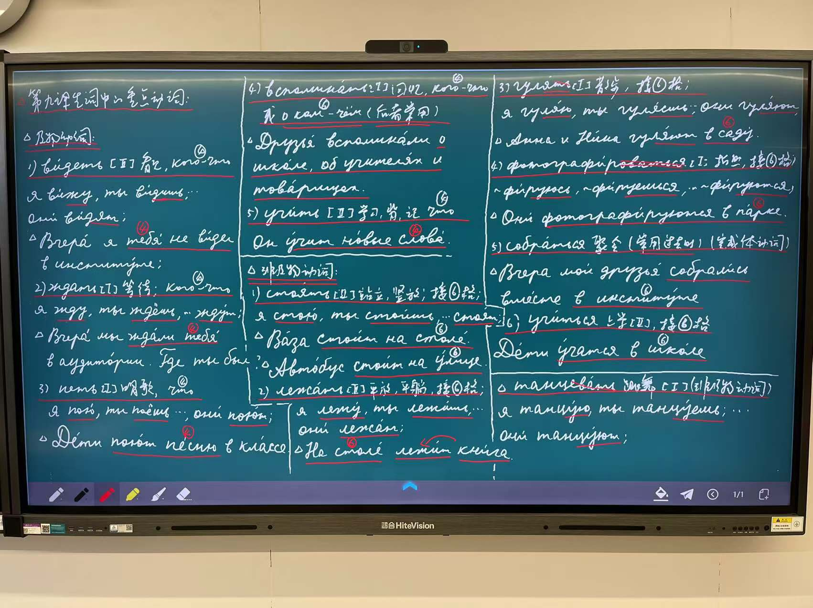
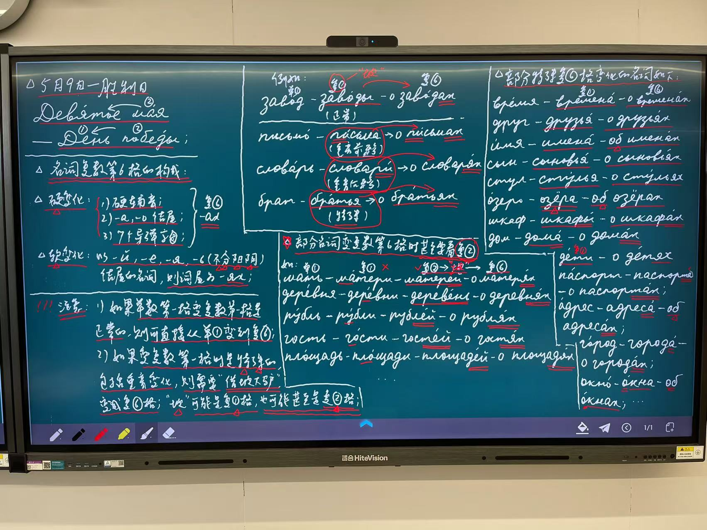
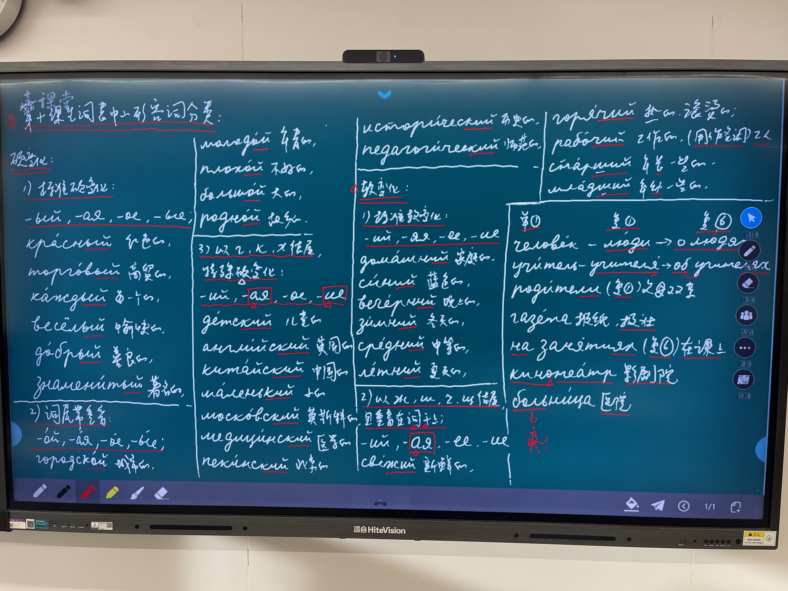

# Lecture Notes 

> Teacher: Hongmei He
> 2025 Spring Semester

## w13

### 20250513 Tues

- [ ] 第十三个教学周第一次课程课后作业：😊😊😊口头作业：1. 熟练完成第89页上的练习19；2. 全面背熟第九课生词，掌握重点单词，尤其是动词的变位、接格关系及其用法；3. 正确朗读第九课第90页至91页上的句型，做到能够熟练替换和运用；4. 正确朗读第九课对话并译成汉语；5. 熟练背诵第九课对话中的重点词组；6. 完成练习25、26；😊😊😊笔头作业：1. 第九课生词每个抄写两遍；2.正确抄写第九课对话并译成汉语；3. 第九课对话中的重点词组抄写两遍并译成汉语；注意动词用不定式；😊😊😊此次作业请于下周第一次课课前交给何老师！祝小伙伴们完成作业顺利！🌹🌹🌹😊😊😊

### 20250516 Fri

上课通知：😊😊😊各位亲爱的小伙伴们，大家好！明天早上我们将迎来第十三个教学周的第二次课程！上课前将继续进行前苏联经典电影展播《莫斯科不相信眼泪》，让我们坚信：生活中的困难只是暂时的，只要我们无惧风雨，勇敢前行，生活就会为我们开满鲜花！🌺🌺🌺✊️✊️✊️上课后首先何老师将继续为小伙伴们带来俄罗斯文化小主题：赏析并教唱著名的俄罗斯歌曲《莫斯科郊外的晚上》！在学习俄罗斯文化的同时也给小伙伴们带来难得的轻松一刻！🎊🎊🎊😊😊😊接下来在语言教学环节我们将首先复习上节课学习过的内容：正确朗读第九课的生词（尤其是动词的变位和接格关系）、句型、对话及重点词组等；😊😊😊新课部分我们将学习第九课的课文，完成相关练习；学习礼貌用语、文化国情等内容；至此我们将结束第九课，开启第十课的学习：正确朗读第十课话题：我生病了；教材中的语法：形容词的硬变化和软变化等；好的！我们明天早上见哈😊😊😊🎉🎉🎉

明天早上上课将要用到的语料有：😊😊😊

[莫斯科郊外的晚上](https://vhsagj.smartapps.baidu.com/pages/lemma/lemma?lemmaTitle=莫斯科郊外的晚上&lemmaId=338753&from=bottomBarShare&_swebfr=1&_swebFromHost=baiduboxapp)

Русская песня: Подмосковные вечера. Под 前缀，意为：在城外的，在郊外的；

第九课及物动词：1. рассказывать, я рассказываю, ты рассказываешь, они рассказывают; 2. учить:я учу, ты учишь, они учат; Он учит русский язык. 3. видеть: я вижу, ты видишь, они видят; Вчера мы видели тебя в библиотеке. 4. ждать: я жду, ты ждёшь, они ждут; Мы тебя ждали вчера в аудитории. 5. петь:я пою, ты поёшь, они поют; Мы поём русскую песню «Подмосковные вечера». 6. вспоминать: я вспоминаю, ты вспоминаешь, они вспоминают; 

第九课非及物动词：1. стоять: я стою, ты стоишь, они стоят; На столе стоит красивая ваза. 2. учиться: я учусь, ты учишься, они учатся;Мы учимся в университете. 3. лежать: я лежу, ты лежишь, они лежат; На столе лежат книги и словари. 4. быть: он был, она была, оно было, они были; Вчера вечером Антон и Нина были в театре. 5. гулять: я гуляю, ты гуляешь, они гуляют; Виктор и Анна гуляют в саду. 6. фотографироваться: я фотографируюсь, ты фотографируешься, они фотографируются; Они фотографируются в парке. 7. собраться:он собрался, она собралась, они собрались; Вчера мои товарищи собрались вместе. 

смотреть фильм по телевизору 观看电视（转播的）上的电影

школьные друзья 中学朋友（同学）；товарищи по школе; 中学同学

танцевать 跳舞；第一变位法；я танцую, ты танцуешь, он она танцует, мы танцуем, вы танцуете, они танцуют; 过去式： он танцевал, она танцевала, они танцевали; 

Я знаю русский язык. 我懂俄语。Я изучаю русский язык. 我钻研学习俄语（作为专业）。Я учу русский язык. 我在学习俄语（具体地行为：读、念、写、背、抄等）；Я учусь в Москве. 我在莫斯科学习（指系统的学习、读书、读学位等）； Я занимаюсь в аудитории. 我在教室上自习。

Я знаю русский язык. 我懂俄语。Я говорю по- русски. 我说俄语。

第九课重点词组：1. 做练习：делать упражнения; 2. 写生词： писать новые слова; 3. 看电视：смотреть телевизор; 4. 谈论有关学习和工作的事宜：разговаривать об учёбе и о работе; 5. 在教室里上自习：заниматься в аудитории; 6. 在宿舍休息：отдыхать в общежитии; 7. 好朋友： большие друзья ( хорошие друзья);8. 喜欢数学：любить математику; 9. 钻研学习英语：изучать английский язык; 10. 做家庭作业：делать домашние задания; 11. 踢足球：играть в футбол; 12. 下象棋： играть в шахматы; 13. 钻研学习俄语： изучать русский язык;14. 出行日：выходной день; 15. 做功课： делать урок; 16. 弹吉他： играть на гитаре; 17. 乘车去听音乐会： ехать на концерт; 18. 看电影： смотреть фильм; 19. 好久没见到你：давно тебя не видеть; 20. 在学院里等你：ждать тебя в институте; 21. 上大学（在大学学习念书）учиться в университете;22. 唱俄语歌：петь русские песни; 23. 在莫大学习（上学）：учиться в МГУ; 24. 在莫斯科工作：работать в Москве; 25. 中小学同学：школьные товарищи; 

第93页练习29参考译文：Мой отец—— инженер.В школе он учил русский язык, потом ещё учился в Москве. Вчера мой отец и его школьные друзья собрались вместе. Старые друзья вместе пели и танцевали, вспоминали о жизни в школе. Вечером они вместе ужинали и фотографировались. 

形容词：1. 硬变化：新的：новый, новая, новое, новые; 旧的：старый, старая, старое, старые; 美丽的：красивый, красивая, красивое, красивые; 美味的：вкусный, вкусная, вкусное, вкусные; 时尚的：модный, модная, модное, модные；红色的：красный, красная, красное, красные; 学校的：школьный, школьная, школьное, школьные; 年青的：молодой, молодая, молодое, молодые; 大的：большой, большая, большое, большие; 不好的：плохой，плохая, плохое, плохие; 英国的： английский, английская, английское, английские; 😊😊😊2. 软变化：家庭的：домашний, домашняя, домашнее, домашние; 蓝色的：синий, синяя, синее, синие; 晚上的：вечерний，вечерняя, вечернее, вечерние; 冬日的：зимний, зимняя, зимнее, зимние; 好的：хороший，хорошая, хорошее, хорошие; 新鲜的：свежий，свежая, свежее, свежие; 滚烫的：горячий, горячая, горячее, горячие; 

большое письмо 一封长信；

молодое дерево 一棵小树

квартира 一套住宅

человек 单一格；люди复一格； о людях 复六格；

- [x] 第十三个教学周第二次课程课后作业：😊😊😊口头作业：1. 正确朗读第九课课文；2. 熟练背诵第九课课文中的重点词组；3. 完成第92页至93页的练习24、25、26、29；4. 牢记著名画家科拉姆斯科依的绘画特点及其代表作；5.正确朗读第十课话题：我生病了；6. 正确朗读第十课练习1、练习2；7. 掌握形容词的硬变化和软变化知识，完成第97页至98页练习3、4、5；😊😊😊笔头作业：1. 正确抄写第九课课文；2. 正确抄写第九课课文中的重点词组每个两遍；动词请用不定式；3. 完成第93页上的练习29，汉译俄；如遇问题可参考何老师分享到群中的参考译文；4. 完成第97页至98页上的练习3；5. 完成第98页上的练习4，构成词组并译成汉语；小伙伴们完成作业辛苦了！🙏🏻🙏🏻🙏🏻😊😊😊本次作业请于下周第一次课课前交给何老师！祝小伙伴们完成作业顺利！😊😊😊🌹🌹🌹🙏🏻🙏🏻🙏🏻

 [何老师第九课重点词组录音示范.m4a](Lectures_2025Spring.assets/何老师第九课重点词组录音示范.m4a) 

‼️‼️请小伙伴们牢记两句话：гкхжшчщ七个“捣乱”字母不能跟я拼，只能跟а拼！不能跟ы拼，只能跟и拼！这样就能搞定形容词的硬变化和软变化了！😊😊😊🙏🏻🙏🏻🙏🏻✌️✌️✌️

## w14

### 20250520 Tues

上课通知：各位亲爱的小伙伴们，大家好！😊😊😊明天早上我们将迎来第十四个教学周的第一次课程！首先何老师将就本次批改好的作业做一详尽的讲评！重点讲解问题，为期末考试助力！😊😊😊语言教学环节中首先何老师将带领小伙伴们复习上节课学习过的内容：正确朗读第九课的课文、重点词组；正确朗读第十课的话题、复习形容词的硬变化和软变化；完成好相关练习；请小伙伴们做好准备！😊😊😊接下来新课部分我们将学习第十课生词表中的形容词的硬、软变化，重点学习形容词单、复数第六格的变化，完成相关练习；😊😊😊温馨提醒一下各位小伙伴：明天早上是上交上周两次课课后作业的时间，请小伙伴们务必带上完成好的作业来上课！同时何老师也会下发批改好的作业并对有需求的小伙伴们做一对一的指导；😊😊😊课前将展播前苏联十分诙谐幽默搞笑的著名影片《意大利人在俄罗斯的奇遇》！给面临期末考试的小伙伴们减压！🎉🎉🎉欢迎时间方便的小伙伴们观看欣赏！😊😊😊好的！咱们明天早上见哈！🌹🌹🌹

明天早上上课将要用到的语料有：😊😊😊

形容词：1. 硬变化：新的：новый, новая, новое, новые; 旧的：старый, старая, старое, старые; 美丽的：красивый, красивая, красивое, красивые; 美味的：вкусный, вкусная, вкусное, вкусные; 时尚的：модный, модная, модное, модные；红色的：красный, красная, красное, красные; 学校的：школьный, школьная, школьное, школьные; 年青的：молодой, молодая, молодое, молодые; 大的：большой, большая, большое, большие; 不好的：плохой，плохая, плохое, плохие; 英国的： английский, английская, английское, английские; 😊😊😊2. 软变化：家庭的：домашний, домашняя, домашнее, домашние; 蓝色的：синий, синяя, синее, синие; 晚上的：вечерний，вечерняя, вечернее, вечерние; 冬日的：зимний, зимняя, зимнее, зимние; 好的：хороший，хорошая, хорошее, хорошие; 新鲜的：свежий，свежая, свежее, свежие; 滚烫的：горячий, горячая, горячее, горячие; 

молодое дерево 一棵小树

большое письмо 一封长信；

квартира 一套住宅

硬变化：

第十课生词表中的形容词分类：

1. 标准的硬变化：- ый, - ая, -ое, - ые; 

красный, 红色的；торговый, 商贸的；каждый, 每一个的；весёлый,愉快的； добрый, 善良的；знаменитый; 著名的；

2. 词尾带重音：                -ой, - ая,   - ое, - ые; 

3. 以г, к, х结尾的特殊硬变化：-ий, -ая, -ое, -ие;

городской, 城市的；молодой, 年青的；плохой,不好的； большой, 大的；родной, 故乡的；

детский, 儿童的；английский, 英国的；китайский,中国的； маленький,小的； московский,莫斯科的； медицинский, 医学的；пекинский, 北京的；исторический, 历史的；педагогический, 师范的；

软变化：

1. 标准软变化：                  -ий, -яя, -ее, -ие;

домашний,家庭的； синий, 蓝色的；вечерний, 晚上的；зимний, 冬季的；средний, 中等的；летний 夏季的；

свежий, 新鲜的；горячий, 热的；рабочий, 工作的；старший,年长一些的； младший ，年幼一些的；

2. 以ж,ш,ч,щ结尾，且重音在词干上；-ий, -ая,-ее, -ие; 

человек 单一格；люди复一格； о людях 复六格；

Зимний дворец 冬宫，第六格：в Зимнем дворце; 注意：‼️“宫殿”一词中的е脱落，隐身了！

родители 复数一格，意为：父母双亲

газета 报纸、报社；

Летний сад 夏园;

на занятиях 复数第六格，在课堂上；原形第一格：занятие；是动词заниматься从事某种活动， 的动名词；

учитель（阳）中小学教师，其复数第一格是учителя，重音在я上，其复数第六格为об учителях，重音也在я上；

кинотеатр 影剧院，是复合词，由кино和театр 构成，其中о是中缀，起到连接两词的作用。

物主代词ваша的第六格单数阴性形式为:вашей; наша的第六格单数阴性形式为：нашей;

Упражнение 16. 补充一句话：Он работает на заводе. 

- [x] 第十四个教学周的第一次课程课后作业：😊😊😊口头作业：1. 掌握形容词单、复数第六格的构成，完成第100页上的练习8、9、10、11；2. 完成第101页上的练习12、13、14、15、16；3. 听何老师的生词录音，开始学习背诵第十课生词，尤其是关注形容词的硬变化、软变化；😊😊😊笔头作业：1. 完成第100页上的练习9、练习10；2. 完成第101页上的练习12、练习13、练习14、练习15；小伙伴们完成作业辛苦了！🙏🏻🙏🏻🙏🏻😊😊😊请大家于下周第一次课课前交给何老师！祝小伙伴们完成作业顺利！🌹🌹🌹🙏🏻🙏🏻🙏🏻

### 20250523 Fri

上课通知：各位亲爱的小伙伴们，大家好！😊😊😊明天早上我们将迎来第十四个教学周的第二次课程！首先何老师将带领小伙伴们复习上节课的内容, 我们将重点复习形容词单、复数第六格的构成；疏理第十课生词表中形容词的硬、软变化；请小伙伴们做好准备！😊😊😊新课部分我们将重点学习指示代词этот的性和数以及第六格的单、复数构成；学习物主代词第六格单、复数的变化，第十课生词表中的动词等内容；😊😊😊课前何老师将为小伙伴们继续展播前苏联诙谐幽默搞笑的经典影片《意大利人在俄罗斯的奇遇》！欢迎观赏！🌹🌹🌹好的！咱们明天早上见！😊😊😊🎉🎉🎉

明天早上上课将要用到的语料有：😊😊😊

 [何老师第十课生词录音示范.m4a](Lectures_2025Spring.assets/何老师第十课生词录音示范.m4a) 

квартира 一套住宅（一居室、两居室、三居室、四居室等）

больница, 医院，其中词根боль是“疼痛”之意；

物主代词单复数第六格的构成：

твой, твоё- о твоём; твоя- о твоей; твои- о твоих; 

мой, моё- о моём; моя- о моей; мои- о моих; 

чей,чьё- о чьём; чья-о чьей; чьи- о чьих; 

свой, своё- о своём; своя-о своей; свои- о своих; 

наш, наше- о нашем; наша- о нашей; наши- о наших; 

ваш, ваше- о вашем; ваша- о вашей; ваши- о ваших; 

注意‼️его, её, их 永远不变！

в своей тетради第六格词组，意为：在自己的练习本上；请注意俄汉语的区别：汉语翻译为“上”，而俄语里却恰恰用的是В!（在⋯里）‼️切记！

сидеть 坐，坐着，坐在；非及物动词；后经常接第六格；变位时发生音变：д变成ж! я сижу, ты сидишь, он(она)сидит, мы сидим, вы сидите, они сидят; 例如： 1. Маша сидит в красивой комнате. 玛莎坐在漂亮的房间里。2. Студенты сидят в больших аудиториях. 大学生们坐在大教室里。

всегда （副）总是；

第十课及物动词：звать:第一变位法：зову,зовёшь, зовёт, зовём,зовёте,зовут; звал, звала, звали; кого-что; 招呼，叫来，叫做；例如：— Как тебя зовут? — Меня зовут Антон. 

第十课非及物动词： 1. сидеть;第二变位法；坐着；сижу, сидишь, сидит, сидим, сидите, сидят; 通常后接第六格，指“坐在哪里”；例如：    • Мы сидим в своей красивой аудитории. •Он сидит в большой библиотеке и читает книгу. 2. родиться: 通常用过去时；出生；接第六格，指“出生在哪里”；例如： Он родился в Пекине. Она родилась в Москве. 

- [x] 第十四个教学周的第二次课程课后作业：😊😊😊口头作业：1. 掌握第98页指示代词этот的性和数的知识，完成第99页上的练习6和练习7；2. 掌握第103页上指示代词第六格的构成知识，完成练习21、练习22；3. 掌握第102页上的物主代词单、复数第六格的构成，完成练习17、18、19、20；4. 掌握第103页上物主代词свой的意义和用法，完成第104页上的练习23、练习24；5. 听何老师的生词录音，继续学习背诵第十课生词，尤其是关注形容词的硬、软变化以及及物动词和非及物动词的用法；😊😊😊笔头作业：1. 完成第99页上的练习6并译成汉语；2. 完成第103页上的练习21；‼️注意更换角色；3. 抄写第102页上的练习17；4. 完成第102页上的练习18；‼️注意更换角色！5. 第十课生词每个抄写两遍；小伙伴们完成作业辛苦了！🙏🏻🙏🏻🙏🏻😊😊😊请大家于下周第一次课课前交给何老师！这也是咱班本学期的最后一次需上交的作业！🙏🏻🙏🏻🙏🏻祝小伙伴们完成作业顺利！🌹🌹🌹🙏🏻🙏🏻🙏🏻

## w15

### 20250527 Tues

上课通知：😊😊😊各位亲爱的小伙伴们，大家好！明天早上我们将迎来第十五个教学周的第一次课程！温馨提醒一下各位小伙伴：明早是咱班上交上周两次课后作业的时间，也是本学期的最后一次交作业，请小伙伴们务必带上已完成好的作业于上课前交给何老师，同时何老师也会下发仔细批改好的作业并对有需求的同学做一对一的指导。😊😊😊课前何老师将与小伙伴们共同欣赏前苏联经典影片《办公室的罗曼史》！🙏🏻🙏🏻🙏🏻🌹🌹🌹上课后，首先何老师将就上周的作业做一详尽的讲评，将其中的主要问题一一进行分析讲解，以此来助力小伙伴们的期末考试复习工作！😊😊😊接下来在语言教学环节何老师首先将带领小伙伴们复习上节课的内容：指示代词этот的性和数及其单复数第六格的构成及用法；物主代词的单、复数第六格的构成，第十课的生词，请小伙伴们做好准备！😊😊😊新课部分何老师将为小伙伴们疏理一系列同根词再次助力大家背诵第十课的生词、学习句型、对话、课文、完成相关练习、国情知识等！结束第十课的学习！😊😊😊之后我们将开启期末考试口试大热身！✊️✊️✊️好的！咱们师生明天早上见哈😊😊😊🌺🌺🌺

明天早上上课将要用到的语料有：😊😊😊

第十课及物动词：звать:第一变位法：зову,зовёшь, зовёт, зовём,зовёте,зовут; звал, звала, звали; кого-что; 招呼，叫来，叫做；例如：— Как тебя зовут? — Меня зовут Антон. 

第十课非及物动词：            1. сидеть，第二变位法，坐着；сижу, сидишь, сидит, сидим, сидите, сидят; 通常后接第六格，指“坐在哪里”；例如：1）Мы сидим в своей красивой аудитории. 我们坐在自己的漂亮的教室里。2）Он сидит в большой библиотеке и читает книгу. 他坐在一间大的图书馆里并且正在阅读书籍。                2. родиться: 通常用过去时；出生；接第六格，指“出生在哪里”；例如： Он родился в Пекине. 他出生在北京。Она родилась в Москве. 她出生在莫斯科。

сидеть 坐，坐着，坐在；非及物动词；后经常接第六格；变位时发生音变：д变成ж! я сижу, ты сидишь, он(она)сидит, мы сидим, вы сидите, они сидят; 例如： 1. Маша сидит в красивой комнате. 玛莎坐在漂亮的房间里。2. Студенты сидят в больших аудиториях. 大学生们坐在大教室里。

第十课生词中的同根词系列：何老师单独疏理出来帮助小伙伴们背诵单词哈😊😊😊

 городской 城市的，（形）（本课）；город城市（名）

детство童年，（名）（本课）；детский 儿童的；（形）（本课）；дети（复）孩子们（名）

домашний, 家庭的；（形）（本课）；дом家，房子（名）；дома在家里（副）；домой往家走，回家；（副）

вечерний 晩上的；夜晚的，（形）；（本课）；вечер晚上（名）；вечером 在晚上（副）；

плохой 不好的；（形）（本课）；плохо 不好（副）

зимний 冬季的；（形）（本课）；зима 冬季（名）；зимой 在冬季（副）；

рабочий 工人的，工人（可用作名词的形容词）（本课）；работать 工作（动）；работа 工作（名）；

китайский 中国的，（形）（本课）；Китай 中国，（名）；китаец 中国人（名）；китаянка 中国女人（名）；

родители （复）父母（名）（本课）；родной 亲爱的，家乡的，（形），（本课）；родиться 出生，诞生；产生；（动）（本课）；

летний 夏季的（形），（本课）；лето 夏季，（名）；летом 在夏天 （副）；

занятие 课堂、课；从事（动名词）（本课）；заниматься 从事 （动）；

больница 医院 （名）（本课）；больной 有病的，病人（可用作名词的形容词）（本课）；形容词短尾：он болен, она больна, оно больно, они больны; … 病了；

московский 莫斯科的 （形）；（本课）； москвич 莫斯科人 （名）（本课）；москвичка 莫斯科女人（名）（本课）；Москва 莫斯科 （名）；

пекинский 北京的，（形）（本课）；Пекин 北京（名）；

недавно 不久前，（副）（本课）；давно 很早以前，早就，很久（副）

рассказ 讲述，故事，短篇小说；（名）（本课）；рассказывать 讲述 （动）；

第十课重点词组：1. 出生在莫斯科：родиться в Москве; 2. 在中学工作：работать в средней школе; 3. 大而美丽的城市：большой и красивый город; 4. 长江：река Янцзы; 5. 在童年：в детстве; 6. 在北大（读书）上学：учиться в Пекинском университете; 7. 俄罗斯语言与文学：русский язык и литература; 8. 每天：каждый день; 9. 说俄语：говорить по-русски; 10. 除此以外：кроме того;11. 听俄语诗歌：слушать русские стихи; 12. 好教师：хороший преподаватель ; 13. 令人愉悦的和善良的人：весёлый и добрый человек; 14. 熟知故乡的城市：хорошо знать свой родной город; 15. 喜欢听他的故事：любить слушать его рассказы; 16. 著名的地方：знаменитые места; 17. 红场： Красная площадь; 18. 历史博物馆：Исторический музей; 19. 大剧院：Большой театр; 20. 冬宫：Зимний дворец; 21. 晚报: вечерняя газета; 22. 我的父母双亲：мои родители

Упражнение 33: Наш русский преподаватель — москвич, его зовут Борис Юрьевич. Он очень любит Москву и хорошо знает свой родной город. Он часто рассказывает о Москве и её знаменитых местах: Красной площади, Историческом музее, Старом Арбате, Большом театре…Мы очень любим слушать его рассказы. Студенты говорят, что он хороший преподаватель, весёлый и добрый человек. Мы изучаем русский язык недавно. Наша специальность— русский язык и литература. Каждый день мы читаем, пишем и говорим по-русски. Кроме того, мы смотрим видеофильмы, слушаем русские стихи и даже поём русские песни. Мы очень любим изучать русский язык. Все мы мечтаем учиться в России! 

потому что因为（连接词）

第十五教学周第一次课课后作业：😊😊😊口头作业：1. 正确朗读第十课句型、对话和课文；2. 熟记第十课重点词组；3. 根据同根词熟练背诵第十课单词并学会运用；4. 完成练习26、27、28、29、30、32；5. 熟记文化国情的主要知识点，牢记俄罗斯著名风景画家希什金及其代表作；6. 全面复习备战期末考试口试，力争达到最佳水平！✊️✊️✊️😊😊😊；笔头作业：1. 正确抄写第十课对话并译成汉语；2. 正确抄写第十课课文并译成汉语；3. 正确抄写第十课重点词组两遍；4. 完成练习29、练习30；5. 完成练习33的以《Наш преподаватель 》为题，利用我们学习过的语料，写一篇约100词左右的俄语短文（可以参照何老师上传到群中的参考短文）。                                      ‼️‼️敬请小伙伴们注意：因下周为结课考试周，本学期即将结束，所以本次作业要求小伙伴们务必完成（因作业内容与期末考试口试和笔试均密切相关‼️‼️），但无需再上交作业。如遇问题，请及时联系何老师答疑！祝小伙伴们完成作业顺利！🙏🏻🙏🏻🙏🏻加油！✊️✊️✊️

### 20250530 Fri

上课通知：😊😊😊各位亲爱的小伙伴们，大家好！明天早上我们将迎来第十五个教学周的第二次课程！首先我们将复习上节课的内容：再次朗读第十课的对话和课文！接下来何老师将带领各位小伙伴们进行期末考试口试的大热身！我们将重点热身30个自由问答题！要力争达到能够正确且流利地回答问题的水平！之后，何老师将带领小伙伴们再次复习朗读第五课至第十课的话题、对话、课文！力争达到用正确的语音、语调、语速朗读的水平！✊️✊️✊️接下来，我们将进行期末考试笔试的大热身！练习做一些模拟题！重点热身汉译俄词组、汉译俄句子、第七、八、九、十课的生词、课文及翻译、动词（含变位、过去时、接格关系）、形容词（硬、软变化、变格）、月份、一周七天、一年四季等！旨在为小伙伴们助力加油！请大家千万不要错过哈！预祝大家期末考试口试+笔试顺利！加油！🙏🏻🙏🏻🙏🏻🌹🌹🌹✊️✊️✊️✌️✌️✌️😊😊😊

小更正：问题20，Где вы родились? 您在哪里出生的？😊😊😊

#### 期末口语考试30个自由问答题（附参考答案）：

 [何老师期末口试30个自由问答题录音示范.m4a](Lectures_2025Spring.assets/何老师期末口试30个自由问答题录音示范.m4a) 

1. Кто твой отец? Мой отец — инженер. Он работает на заводе. 
2. Что стоит на столе? На столе стоят красивые цветы. 
3. Что ты читаешь? Я читаю книгу и газету. 
4. Что делала Инна вчера вечером? Вчера вечером она смотрела телевизор. 
5. Какой язык ты знаешь? Я знаю китайский, английский и русский языки.
6. Который час сейчас? Сейчас два часа.
7. Куда они едут? Они едут в Москву.
8. Когда ты встаёшь утром каждый день?Каждый день утром я встаю в шесть часов.
9. Где Миша учился раньше?Раньше он учился в Санкт-Петербурге.
10. Где Виктор был вчера?Вчера он был в институте.
11. Чья это машина?Это моя машина.
12. Какой сегодня день?Сегодня понедельник. 
13. Почему Анна много работает? Она хочет учиться в России.
14. Какое время года ты любишь? Я люблю весну и зиму. 
15. Где учится твой брат? Мой брат учится в МГУ. 
16. Ребята хорошо знают о тебе?Да, они хорошо знают обо мне.
17. О чём вы разговариваете? Мы разговариваем об учёбе и о жизни в университете. 
18. О ком рассказывал ваш преподаватель сегодня на уроке ? Сегодня на уроке он  рассказывал о великом русском поэте Пушкине. 
19. В каком городе ты живёшь?Я живу в большом и красивом городе Шанхае.
20. Где вы родились?Я родился в Киеве. Я родилась в Москве. 
21. Где вы учились раньше? Раньше мы учились в школе . 
22. Какой язык они учили в школе? В школе они учили английский язык. 
23. Как вы говорите по-русски? Мы говорим по-русски очень хорошо.
24. Где обычно занимаются студенты? Они обычно занимаются в аудиториях и библиотеках. 
25. Какой язык изучает Виктор? Он изучает китайский язык. 
26. Что ты делал (-ла)вчера вечером? Вчера вечером я слушал(-ла)музыку, читал(-ла )книгу, писал(-ла )новые слова и смотрел(-ла )телевизор. 
27. Кто такой Антон? Антон - хороший  преподаватель, весёлый и добрый человек. 
28. Какой ваш родной город? Мой родной город— Пекин. 
29. Ты любишь изучать русский язык? Да, я люблю изучать русский язык. 
30. Когда у вас уроки русского языка? У нас уроки русского языка во вторник и в пятницу. 

#### 期末笔试热身语料：

模拟题汉译俄句子+参考译文：

1. 安东是一位大学生，他在莫大上学。他研究汉语。他汉语说得不错。
2. Антон - студент. Он учится в МГУ. Он изучает китайский язык. Он говорит по- китайски неплохо. 

2. 昨天是休息日。我的父母不工作。他们去了大剧院，观看了俄罗斯的芭蕾舞剧。他们休息得很好！
2. Вчера был выходной день. Мои родители не работали. Они были в Большом театре, смотрели русский балет. Они отдыхали хорошо. 

3. 我的妈妈是一位女教师。她在这所中学工作。学校在喷泉旁。她工作得很好。
3. Моя мама- учительница. Она работает в этой средней школе. Школа стоит у фонтана. Она работает очень хорошо. 

4. 谢尔盖每天勤奋用功，博览群书，大量写作，说汉语，因为他想在北京大学留学。
4. Каждый день Сергей много работает, много читает, много пишет и говорит по-китайски, потому что он хочет учиться в Пекинском университете. 

5. 今天是周日，我们在家休息。爸爸和妈妈在读报，姐姐在吃美味的香蕉和苹果，而我在听音乐。
5. Сегодня воскресенье. Мы отдыхаем дома. Папа и мама читают газету, а старшая сестра ест вкусные бананы и яблоки, а я слушаю музыку. 

6. 他们是俄语学院的大学生。他们的专业是俄语语言文学。每天他们读、写、做练习、回答老师的问题。
6. Они студенты Института   русского языка. Их специальность - русский язык и литература. Каждый день они читают, пишут, делают упражнения и отвечают на вопросы преподавателя. 

7. 十二月、一月、二月是冬天，玛莎喜欢冬天。六月、七月、八月是夏天，维克多喜欢夏天。
7. Декабрь, январь, февраль - зима. Маша любит зиму. Июнь, июль, август- лето. Виктор любит лето. 

8. 今天是星期一，我要去学院上课。我乘坐地铁去学院，我上学上得很好。
8. Сегодня понедельник. Я еду в институт на урок. Я еду на метро. Я учусь очень хорошо. 

9. 每天大学生们都在这间新的时尚的图书馆里上自习。他们做功课、背诗歌、写生词、读书。
9. Каждый день студенты занимаются в этой новой модной библиотеке. Они делают урок, учат стихи, пишут новые слова, и читают книгу. 

10. 王华是一位中国大学生。他在俄罗斯留学。他俄语说得很好。并且在莫斯科生活得也很好。
10. Ван Хуа - китайский студент. Он учится в России. Он говорит по-русски очень хорошо. Он живёт в Москве тоже очень хорошо. 

11. 今天是星期二，我的哥哥去工作。他七点起床，吃早餐，并且乘坐公共汽车去工厂。
12. Сегодня вторник. Мой старший брат едет на работу. Он встаёт в семь часов, завтракает и едет на автобусе на завод. 

12. 安德烈在讲述他自己的好朋友的情况。他的朋友是一位俄罗斯人，住在美丽的圣彼得堡，他是一位著名的艺术家。
13. Андрей рассказывает о своём большом друге. Его друг- русский, живёт в красивом Санкт- Петербурге. Он известный художник. 

13. 上海是一座大而漂亮的城市。在这座城市里有大楼（复数）、高等院校（复数）、商店（复数）、运动场（复数）和街道（复数）。
14. Шанхай - большой и красивый город. В этом городе большие дома, вузы, магазины, стадионы и улицы. 

14. 今天米沙没有来开会，他病了。小伙伴们都在教室里等他。会上谈到了大学的生活（单数）和图书馆里的书（复数）。
15. Сегодня Миша не был на собрании. Он был болен. Ребята ждали его в аудитории, говорили о жизни в университете и о книгах в библиотеке. 

15. 原来卡佳住在基辅，而现在住在北京。她在清华大学（Университет Цинхуа)上学。她学习很好！她很喜欢这所著名的大学。
16. Раньше Катя жила в Киеве. А теперь она живёт в Пекине. Она учится в Университете Цинхуа. Она учится очень хорошо. Она очень любит этот известный университет.

重点词组：1. 吃新鲜的菠萝：есть свежие ананасы; 2. 吃热汤：есть горячий суп; 3. 读书和报刊杂志：читать книгу, газету и журнал; 4. 听音乐：слушать музыку; 5. 在美丽的花园里散步：гулять в красивом саду; 6. 在周六： в субботу; 7. 谈论关于我的情况： разговаривать обо мне; 8. 乘公共汽车： ехать на автобусе; 9. 乘坐地铁： ехать на метро; 10. 谈论关于我的生活和工作： разговаривать о моей жизни и работе; 11. 飞往莫斯科：лететь в Москву; 12. 师范学院： педагогический институт; 13. 医学院： медицинский институт; 14. 历史系： исторический факультет; 15. 一年四季： времена года; 16. 喜欢春天： любить весну; 17. 站在喷泉旁：стоять у фонтана; 18. 在工厂工作：работать на заводе; 19. 背单词：учить новые слова; 20. 6点钟：шесть часов; 21. 唱歌跳舞： петь и танцевать; 22. 回忆起学校和老师同学：вспоминать о школе, об учителях и товарищах; 23. 高楼： большие дома; 24. 起床很早： вставать рано; 25. 他有课：у него уроки; 26. 购买蔬菜和苹果：покупать овощи и яблоки; 27. 回答问题：отвечать на вопросы; 28. 去上课： идти на урок; 29. 去上班（工作）： идти на работу; 30. 懂俄语：знать русский язык; 31. 梦想在俄罗斯学习：мечтать учиться в России; 32. 美丽的花朵： красивые цветы; 33. 写信： писать письмо; 34. 在小吃部吃午饭:обедать в буфете; 35. 在咖啡厅吃晚饭：ужинать в кафе; 

第九课重点词组：1. 做练习：делать упражнения; 2. 写生词： писать новые слова; 3. 看电视：смотреть телевизор; 4. 谈论有关学习和工作的事宜：разговаривать об учёбе и о работе; 5. 在教室里上自习：заниматься в аудитории; 6. 在宿舍休息：отдыхать в общежитии; 7. 好朋友： большие друзья ( хорошие друзья);8. 喜欢数学：любить математику; 9. 钻研学习英语：изучать английский язык; 10. 做家庭作业：делать домашние задания; 11. 踢足球：играть в футбол; 12. 下象棋： играть в шахматы; 13. 钻研学习俄语： изучать русский язык;14. 出行日：выходной день; 15. 做功课： делать урок; 16. 弹吉他： играть на гитаре; 17. 乘车去听音乐会： ехать на концерт; 18. 看电影： смотреть фильм; 19. 好久没见到你：давно тебя не видеть; 20. 在学院里等你：ждать тебя в институте; 21. 上大学（在大学学习念书）учиться в университете;22. 唱俄语歌：петь русские песни; 23. 在莫大学习（上学）：учиться в МГУ; 24. 在莫斯科工作：работать в Москве; 25. 中小学同学：школьные товарищи; 

 [何老师第十课课文中的重点词组录音示范.m4a](Lectures_2025Spring.assets/何老师第十课课文中的重点词组录音示范.m4a) 

第十课重点词组：1. 出生在莫斯科：родиться в Москве; 2. 在中学工作：работать в средней школе; 3. 大而美丽的城市：большой и красивый город; 4. 长江：река Янцзы; 5. 在童年：в детстве; 6. 在北大（读书）上学：учиться в Пекинском университете; 7. 俄罗斯语言与文学：русский язык и литература; 8. 每天：каждый день; 9. 说俄语：говорить по-русски; 10. 除此以外：кроме того;11. 听俄语诗歌：слушать русские стихи; 12. 好教师：хороший преподаватель ; 13. 令人愉悦的和善良的人：весёлый и добрый человек; 14. 熟知故乡的城市：хорошо знать свой родной город; 15. 喜欢听他的故事：любить слушать его рассказы; 16. 著名的地方：знаменитые места; 17. 红场： Красная площадь; 18. 历史博物馆：Исторический музей; 19. 大剧院：Большой театр; 20. 冬宫：Зимний дворец; 21. 晚报: вечерняя газета; 22. 我的父母双亲：мои родители
